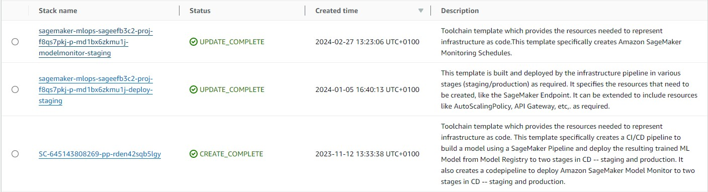
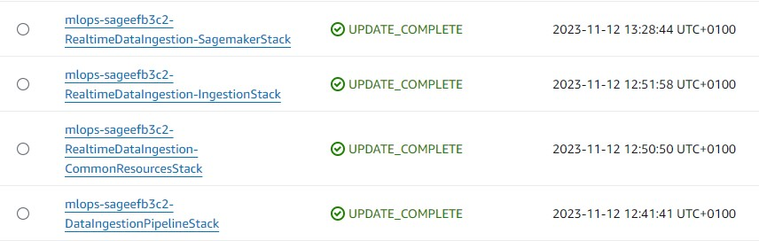

# Delete the Entire Project
This project contains 3 main parts:
* The resources deployed through the CDK
* The SageMaker MLOps Project deployed using the Service Catalog through the CDK 
* The different SageMaker resources deployed throughout the life of the MLOps pipeline (e.g. model endpoints, model monitoring resources, etc.)

These resources have to be deleted following the below steps.
## 1. Stop SageMaker Studio App
In your SageMaker Studio domain, make sure you stopped any running Code Editor and/or JupyterLab spaces.
Otherwise the deletion of the SageMaker stack will fail.
## 2. Delete the SageMaker MLOps ddeploy & monitor stacks
The CDK SageMaker project uses AWS Service Catalog to deploy a the SageMaker MLOps project. Service Catalog uses CloudFormation in the background to deploy 4 stacks (2 for staging and 2 for prod) as shown in the screen capture below for the 2 staging stacks.

In the CloudFormation console, delete each of these 4 stacks manually from top to bottom. The project stack will be deleted when deleting the CDK Sagemaker stack.
## 3. Delete the SageMaker project stack
In the CloudFormation console delete the SageMaker project stack (looking similar to the 3rd stack in the above screen capture).
## 4. Delete the SageMaker resources
Throughout the MLOps lifecycle, different resources are deployed outside of the Infrastructure as Code stacks of both the CDK Infrastructure stack and the AWS Service Catalog MLOps project stack (e.g. SageMaker ML models).
We provide a Step Function, to orchestrate the cleanup of all those resources. In the Step Functions console, 
1. select the `mlops-********-cleanup-sagemaker-project-role-statemachine`
2. click on `Start Execution`
3. when asked for an input, just click again on `Start Execution`

Depending on how lon you let the project run, it can take quite some time > 15 minutes) to cleanup all resources (i.e. every model monitoring task, which are run hourly generate SageMaker trial).
## 5. Cleanup the raw data ingestion bucket (optional)
The S3 bucket storing the raw data ingested through Kinesis Firehose is configured to automatically delete the objects.
Depending on how long you ran the demo and how much data are stored it can take quite some time for the cleanup of the S3 bucket to complete through CloudFormation.
If you want to fasten the deletion of the `mlops-********-RealtimeDataIngestion-IngestionStack` stack, we recommend to manually empty the data ingestion bucket `mlops-********-input-bucket-********` before hand.
## 6. Delete the CDK Stacks
Unfortunately running the CLI command 
```
cdk destroy
```
will only destroy the CI/CD pipeline stack, not the data ingestion and the SageMaker stacks. 
To delete all resources, go into CloudFormation and delete the stacks manually. You should have 4 remaining CloudFormation stacks as shown in the following screen capture (stack prefixes will be unique to your deployment)

Delete each of these stacks manually from top to bottom:
1. Delete the mlops-********-RealtimeDataIngestion-SagemakerStack
2. Delete the mlops-********-RealtimeDataIngestion-IngestionStack
3. Delete the mlops-********-RealtimeDataIngestion-CommonResourcesStack
4. Delete the mlops-********-DataIngestionPipelineStack
