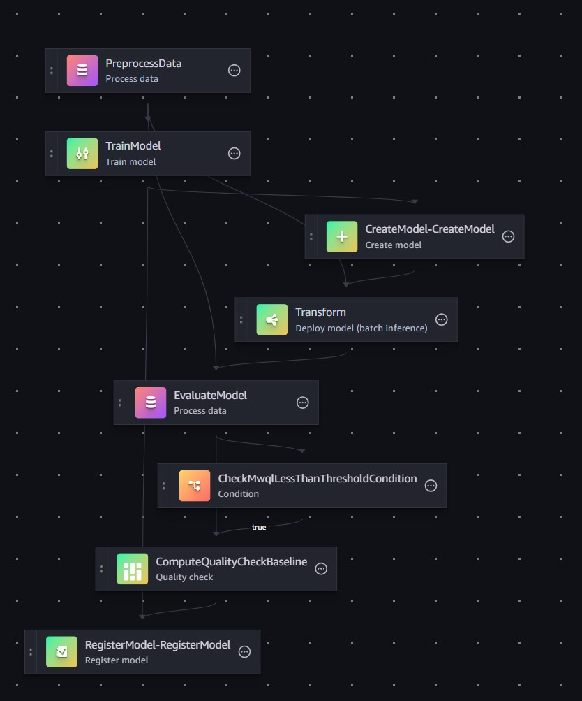

# Fully Automated MLOps Pipeline
## MLOps pipeline Objectives
1. Build an [Amazon DeepAR forecasting model](https://docs.aws.amazon.com/sagemaker/latest/dg/deepar.html)
2. Deploy the trained model automatically if it passes accuracy threshold and is manually approved
3. Monitor the model accuracy
4. Automatically re-trigger a model training based on the latest data if the deployed model’s metric falls below expected accuracy
## The Model
### Amazon DeepAR Forecasting
As the ingestion pipeline aggregates in near real time blockchain transaction metrics into Amazon SageMaker
Feature Store, we chose to forecast the average transaction fee.

In order to train a forecasting model, we decided to use [Amazon Forecasting Algorithm](https://docs.aws.amazon.com/sagemaker/latest/dg/deepar.html).
That algorithm is better suited for one-dimensional multi time series (e.g. energy consumption of multiple households).
However, in our case we have a one-dimensional (average transaction fee) single time series (one stream of blockchain
transactions). But as per AWS documentation, DeepAR can still be used for single time series, and based on the quick
test we performed, it is the model that was performing the best.

But the main objective of this demo is – not – to train the most accurate model. We just need – a – model to test a
fully automated MLOps lifecycle and using a prepackaged AWS model, greatly simplified our pipeline and demo development.

The model is trained to forecast the next 5 average transaction fee. As we aggregate data per minute,
it forecasts average transaction fee on the blockchain 5 minutes in the future.

To evaluate the accuracy of the model, this demo uses the mean quantile loss metric. See:
* [Use the SageMaker AI DeepAR forecasting algorithm](https://docs.aws.amazon.com/sagemaker/latest/dg/deepar.html)
* [Weighted Quantile Loss](https://docs.aws.amazon.com/forecast/latest/dg/metrics.html#metrics-wQL)
* [How to Evaluate Probabilistic Forecasts with Weighted Quantile Loss](https://website-nine-gules.vercel.app/blog/how-to-evaluate-probabilistic-forecasts-weighted-quantile-loss)
### Model Parameters
We do __not__ want want the parameters used for training and monitoring the model hardcoded in the code repositories or
notebooks. We want these parameters to be decoupled from the pipeline and model code.

Why?

Because this way we can update how the model is trained and monitored without having to commit, merge code and run
pipelines. Throughout the MLOps lifecycle, the MLOps pipeline can update those parameters (e.g. tuning 
hyperparameters, model validation threshold) which will automatically be used by the MLOps pipeline processes the next
time they run.

To achieve this, parameters describing the
* model target
* hyperparameters for model training,
* parameters for model evaluation

are stored in SSM parameters. The initial values are set and deployed - if they do not exist - through the "Model Build"
pipeline and can then evolve independently. The initial parameters are set according to the values in the
`\resources\sagemaker\pipeline-modelbuild-code\model-build-params.json` file:
```
{
    "target": {
        "target_col": "avg_fee_1min",
        "prediction_length": 5,
        "freq": "1min",
        "num_validation_windows": 10
    },
    "training-hyperparameters": {
        "epochs": 253,
        "early_stopping_patience": 40,
        "mini_batch_size": 114,
        "learning_rate": 0.004968,
        "dropout_rate": 0.10126986,
        "embedding_dimension": 19,
        "likelihood": "student-T"
    },
    "validation-threshold": {
        "weighted_quantile_loss": 0.24,
        "update_rate": 0.5,
        "consecutive_breach_to_alarm": 3,
        "confidence": 90
    }
}
```

The parameters in the `target` block refer to:
* The value being predicted (the average transaction fee on the blockchain during the next minute).
Other values could be one of the values aggregated by the Apache Flink job:
  * `total_nb_trx_1min` the total number of transactions
  * `total_fee_1min` the total amount of transaction fees
* The forecasting period: 5 data points = 5 minutes
* The frequency (used for the DeepAR algorithm data)
* The number of validation windows used when training a model

For explanation on the hyperparameters in the `training-hyperparameters` block, please refer to AWS documentation
[DeepAR Hyperparameters](https://docs.aws.amazon.com/sagemaker/latest/dg/deepar_hyperparameters.html).
A notebook is available to train new hyperparameters in `\resources\sagemaker\notebooks\model-hypertunning.ipynb`
(upload it together with the `utils.py` file in the same folder to the SageMaker Studio code editor environment).

The parameters in the `validation-threshold` block refer to:
* `weighted_quantile_loss` - the initial threshold at which a model is considered good enough to be deployed in production.
In this demo, this value stored in an SSM parameters will be lowered over time as (hopefully) better and better model
are trained.
* `update_rate` - the rate at which we update the `weighted_quantile_loss` validation threshold. In this demo we use
a very simple approach `abs(new_model_weighted_quantile_loss_value - weighted_quantile_loss_threshold) * update_rate`.
See the section below [How is the model accuracy threshold updated?](#how-is-the-model-accuracy-threshold-updated)
* `consecutive_breach_to_alarm` - refers to the number of times the validation threshold must be breached by the model
before an alarmed is raised and a new model automatically retrained.
* `confidence` percentage - refers to the quantiles used to compute the mean quantile loss metric. A `confidence` of 90%
means using the 5th and 95th quantiles together with the median.
Explanation of confidence interval can be found here: [Confidence Interval](https://www.geeksforgeeks.org/confidence-interval/)
## The Architecture
Refer to [this documentation](./INGESTION.md) for the details about the near real time data ingestion pipeline architecture.
This architecture abstracts the data ingestion pipeline to focus on the MLOps architecture to train and operate the model.

The architecture is based on AWS provided SageMaker project for MLOps (provisioned through AWS Service Catalog) which 
we adapted to our project. The SageMaker project provides the following:
1. An AWS CodeCommit repository and AWS CodePipeline pipeline for
   1.	model building
   2.	model deployment
   3.	model monitoring
2. An Amazon S3 Bucket to store all the artifacts generated during the MLOps lifecycle


1. The "Model Build" repository and pipeline deploy a SageMaker pipeline to train the forecasting model.
The build phase of that pipeline also creates SSM Parameters (if they do not exist, see above) holding the parameters
for the model training and to evaluate the model accuracy.
2. The manual approval of a trained model automatically triggers the "Model Deploy" pipeline.
3. The "Model Deploy" pipeline deploys in the staging environment (and later on, in the production environment if
approved) of the model behind an Amazon SageMaker API Endpoint.
4. Once the endpoint is in service, this automatically triggers the deployment of the "Model Monitoring" pipeline
to monitor the new model.
5. On an hourly schedule, another SageMaker pipeline is triggered to compare the model forecast results with the
latest datapoints.
6. If the model forecasting accuracy falls under the acceptable threshold, the "Model Build" pipeline is automatically
re-triggered, to train a new model based on the latest data.
## Building the Model with the SageMaker Pipeline
The SageMaker pipeline is different from the CodePipeline type of pipelines used to deploy infrastructure and
applications. It is a pipeline used to train the machine learning model.



The SageMaker project comes with a built-in SageMaker pipeline code which we had to refactor to match our use case.
Our pipeline consists of the following steps:
1. Read the data from SageMaker Feature store, extract the last 5 data point as a test dataset to evaluate the model
and format the data for the DeepAR algorithm.
2. Train the model.
3. Create the trained model.
4. Make a batch prediction of the next 5 data points based on training data.
5. Evaluate the forecast accuracy by computing the model’s mean quantile loss between the forecast and test datapoints.
6. Check the model accuracy compared to the threshold stored in the SSM parameter (deployed by the "Model Build" pipeline).
7. Compute the model quality baseline (which will be store in S3 in a 
`model_quality_check/constraints.json` file) which will be used by the default SageMaker monitoring
to evaluate the model, against these constraints.
8. Register the trained model if its accuracy passes the threshold.

For any pipeline execution, all the output files of the different jobs in the pipeline are stored in S3 in
`sagemaker-project-<PROJECT ID>/mlops-*******-model-training/pipeline_executions/<SAGEMAKER PIPELINE EXECUTION ID>/`.
Unfortunately, there is no simple way to see the execution ID other than opening the pipeline execution inside
the SageMaker Studio environment and checking the ID.
## Deploying the Model
Once the model is registered in SageMaker, it must be manually approved in order to be deployed in the staging
environment first. The approval of the model will automatically trigger the "Model Deploy" pipeline.
This pipeline performs 3 main actions.
1. As the model has been approved, we take this new model accuracy as the new model threshold (taking into account the
`update_rate` parameter, see the section below
[How is the model accuracy threshold updated?](#how-is-the-model-accuracy-threshold-updated)). If it is better (lower
is better for our metric) than the existing one, then we update the SSM parameter. You might not want to do that for
your use case, as you might have fixed business/legal metric that you must match. But for this demo we decided to
update the model accuracy as new models are retrained, hopefully building an increasingly accurate models as time passes.
2. A first AWS CodeDeploy stage deploys the new model behind an Amazon SageMaker endpoint which can then be used to
predict 5 data points in the future.
3. Once the model has been deployed behind the staging endpoint, the pipeline has a manual approval stage before
deploying the new model in production. If approved, then a second AWS CodeDeploy stage deploys the new model behind a
second Amazon SageMaker endpoint for production.

### How is the model accuracy threshold updated?

__Custom Metric:__

For this demo we chose a simple approach: if the new model mean quantile loss is lower than the existing threshold,
we add to the new model mean quantile loss, the difference between the existing threshold minus the new model
mean quantile loss multiplied by the `update_rate` (set by the model build pipeline parameter file `model-build-params.json`):

`new_threshold = new_model_mean_quatile loss + (new_threshold - new_model_mean_quatile loss) * update_rate`

With an `update_rate` of `0`, the validation threshold is never updated. With a value of `1`, the new model mean
quantile loss value becomes the new threshold. By default, we take a middle ground where we reduce the evaluation
threshold by half of the *accuracy* gained by the new model.

We do this not to update the monitoring threshold too quickly, otherwise if we were lucky to train a model which
performed very good on the test data for that particular run, we might set the bar too high (set the mean
quantile loss threshold too low in our case) and subsequent predictions will fail to pass the new threshold
immediately after deployment.

__Built-in Model Monitoring:__

If the `register_new_baseline` parameter of the `QualityCheckStep` step of the
[SageMaker pipeline](../resources/sagemaker/pipeline-modelbuild-code/pipelines/blockchain/pipeline.py)
is set to True using the
[pipeline RegisterNewModelQualityBaseline parameter](../resources/sagemaker/pipeline-modelbuild-code/pipelines/run_pipeline.py#L104),
then SageMaker automatically takes the last model metric as the new baseline for monitoring and we can't influence like
we do for the custom metric the rate at which we want to update the monitoring threshold.
## SageMaker Model Monitoring
The SageMaker service includes a model monitoring functionality, which can only be run on a schedule. At a high level it
simply compares predicted values from the model endpoints to ground truth values, computes an accuracy metric and
raises an alarm if the accuracy is below the threshold stored in a `constraints.json` file (created during the model
training in our case - see below
["How is the model accuracy threshold configured?"](#how-is-the-model-accuracy-threshold-configured)).
### How is the Default Monitoring Metric Computed?
As per AWS [documentation](https://docs.aws.amazon.com/sagemaker/latest/dg/model-monitor-model-quality.html):
> Model quality monitoring jobs monitor the performance of a model by comparing the predictions that the model makes
> with the actual Ground Truth labels that the model attempts to predict. To do this, model quality monitoring merges
> data that is captured from real-time or batch inference with actual labels that you store in an Amazon S3 Bucket,
> and then compares the predictions with the actual labels.

Querying the model's endpoint to preform predictions that will be compared with ground truth data is something that you
must orchestrate. You must also ensure that the predictions and ground truth data are delivered in the Amazon S3 Bucket
before the monitoring job runs.
#### How is the model accuracy threshold configured?
You can use a fixed accuracy threshold or update it as your pipeline retrains (hopefully) better model. This will
depend on your business requirements. In this demo the model accuracy is updated each time we retrain of model if the
new model performance is better than the previous one. When the SageMaker pipeline trains a new model, the
`ComputeQualityBaseline` step of the SageMaker pipeline stores in Amazon S3 the latest model baseline and the
constraints to evaluate the model. The file containing the evaluation constraints can be found in the SageMaker
Project S3 Bucket:

`sagemaker-project-<PROJECT ID>/mlops-*******-model-training/pipeline_executions/<SAGEMAKER PIPELINE EXECUTION ID>/model_quality_check/constraints.json`

When the "Model Monitor" CodePipeline pipeline is executed, it goes and reads those constraints to deploy the model
monitoring with the latest model accuracy threshold.
#### How are model predictions collected?
By enabling [Data Capture](https://docs.aws.amazon.com/sagemaker/latest/dg/model-monitor-data-capture.html) on your
model endpoint, you can get the SageMaker model endpoint to store the predictions into an S3 Bucket. In our case,
it is set to store the predictions in the SageMaker Project S3 Bucket:

`sagemaker-project-<PROJECT ID>/datacapture-staging/mlops-*******-<PROJECT ID>-staging/AllTraffic/YYYY/MM/DD/HH/record_*.jsonl`

When the monitoring job is configured to monitor the model endpoint, it will use the endpoint data capture
configuration to retrieve the predictions and use them together with the ground truth data to compute the model's
accuracy. Using the model's endpoint to make predictions that will be used by the model monitoring job is something
that you have to orchestrate.
#### How are ground truth data collected?
When you create your monitoring job, you specify the Amazon S3 Bucket path where your ground truth labels will be
stored. When you perform predictions for the model monitoring, you must store your ground truth labels in that
Amazon S3 Bucket. In our case, we store the ground-truth data in the SageMaker Project S3 Bucket:

`sagemaker-project-<PROJECT ID>/ground-truth-staging/mlops-*******-<PROJECT ID>-staging/YYYY/MM/DD/HH/record_*.jsonl`
#### How are ground truth data matched to predictions?
When you perform predictions for your model monitoring you must assign them an `eventId` or `inferenceId`
([see documentation](https://docs.aws.amazon.com/sagemaker/latest/dg/model-monitor-model-quality-merge.html))
for each data point. The monitoring job will use this ID field to match each prediction with its ground truth
value to compute the accuracy metric.

For the same date and hour, if you compare the ground truth and prediction `record_0.jsonl` files, you will see
the `eventID` that is used to match the records. You will also see the ground truth value in one file, compared
to the prediction in the other file.
### The Limitations of AWS Built-in Model Monitoring
Currently:
1. It is built for tabular datasets and models, but in our case we are dealing with time series and a
forecasting model.
2. It only computes classic
[regression, classification or multiclass metrics](https://docs.aws.amazon.com/sagemaker/latest/dg/model-monitor-model-quality-metrics.html)
like `MAE`, `RMSE`, `confusion matrix`, etc. but in this demo we chose the Mean Weighted Quantile Loss metric to
evaluate our model.
3. It can only be run on a schedule and cannot be triggered based on events. This is an issue in our case.
As we are dealing with time series, instead of tabular data, we have to generate the monitoring data before
the monitoring job runs.
4. A model monitoring raising an Alarm if the model accuracy falls below the threshold does not generate an event
in AWS EventBridge. So, it is not possible to directly trigger task automation if the model's accuracy is breached.
### How did we Worked Around Those Limitations?
The built-in Amazon SageMaker model monitoring is designed to compare ground truth and predictions for tabular
datasets. But we have a time series and as we feed the model with one time series we get the next 5 minutes
forecast (5 data points) predictions.

As per [Amazon DeepAR Algorithm documentation](https://docs.aws.amazon.com/sagemaker/latest/dg/deepar.html#deepar-inputoutput),
RMSE is a metric which can be used to evaluate the DeepAR algorithm.
So we configured the built-in model monitoring job as a regression type with the RMSE metric.
We then created an Amazon SageMaker pipeline, which we run on a schedule 30 minutes before the monitoring job
schedule, to run [a monitoring metrics data collection job](../resources/sagemaker/pipeline-modelmonitor-code/resources/pipelines/data_collection/monitoring_data_collection.py).
The job takes the latest time series data, takes out the last 5 data points as ground truth values and queries
the model's endpoint to forecast the 5 data points that we took out. Our custom monitoring data collection
job then tricks the system by taking the 5 ground truth data points and 5 predictions and treats them, not
as two time series but as 5 individual data points stored in the `record_*.jsonl` files described previously.
It assigns to each matching record a unique `eventId` and writes the ground truth data file and the predictions
into the Amazon S3 Bucket, into the paths configured on the model endpoint data capture and monitoring job
configuration (see above). This way the monitoring jobs sees 5 ground truth data point with predictions
matching on the `eventId` and computes the RMSE accuracy metric based on those 5 data points.

This however still doesn't solve 2 problems:
* We can't use a custom metric.
* If the SageMaker Monitoring raises an Alarm, it doesn't generate an event in EventBridge that we can use
to automate model retraining.

This is why we also created a custom metric.
## Custom Model Monitoring
In parallel to our data collection job for the built-in SageMaker model monitoring job, we deploy and run
another [custom metric processing job](../resources/sagemaker/pipeline-modelmonitor-code/resources/pipelines/data_collection/custom_monitoring_metrics.py)
in the scheduled SageMaker pipeline. Similarly to the first job, this one reads the data, extract the
latest 5 data points as ground truth data and performs a prediction by sending the time series data to the
SageMaker model endpoint. But then, the job directly computes the custom mean weighted quantile loss metric and
stores the custom metric in CloudWatch for the model. A CloudWatch Alarm is also deployed to raise an
alarm if the value of the custom metric goes above the accuracy threshold.

The accuracy threshold is evolving as new models are being re-trained and deployed. When the new model
is approved and deployed, the CodeBuild phase of the "Model Deploy" pipeline updates the accuracy threshold
in an SSM Parameter Store parameter. Then, when the "Model Monitor" pipeline runs, it reads the new model
accuracy value from the SSM Parameter Store and updates the alarm with the new threshold value. This is
how we propagate to the CloudWatch alarm the accuracy threshold of the latest model in order for the newly
deployed model to be monitored using CloudWatch against the latest accuracy threshold value.

The "Model Monitor" pipeline deploys a CloudWatch dashboard (see screen capture below) for both the staging and
production endpoints showing
* in blue - the mean weighted quantile loss accuracy metric the model is monitored against
* in orange - the measured mean weighted quantile loss accuracy metric of the model when the custom monitoring job
was executed
* in green - the Lambda function that is triggered when the CloudWatch alarm is raised
## Triggering Automatic Model Retraining
Once we have in CloudWatch our custom metric and alarm configured, it is easy to trigger the "Model Build"
pipeline to retrain a new model. We set a Lambda Function as the target of the alarm which is triggering
the "Model Build" pipeline.

With this approach, we are able to fully automate the model training, deployment, monitoring and
re-triggering of the whole cycle, hence achieving our objective of a fully automated MLOps pipeline.
## Challenges
### Using a SageMaker Project
The use of the SageMaker Project provided through AWS Service Catalog, was of significant help to quickly
build the overall framework for our fully automated MLOps pipeline. However, it comes with a constraint:
the model build, deploy and monitor pipelines are fixed by that AWS Service Catalog product and might not
exactly fit your need. In this demo for example, in order to set and update the model accuracy threshold
stored in SSM parameters we used the CodeBuild phase of the different pipelines to update that threshold
(Build phase of the "Model Deploy" pipeline) or read it to create the alarm metrics. This is not necessarily
the best way and place to do that, but it is the best solution we found given that fixed framework.

As with every built-in framework, you can save time and move faster by benefiting from a pre-built solution,
but you lose in flexibility.
### Model Monitoring
As described above, we faced the limitations of the built-in model monitoring provided by SageMaker. Working
around them was not an easy challenge as the AWS documentation describing data collection, how records are
matched and how the model monitoring jobs works is sometimes not very detailed or simply does not apply to
our time series forecasting use case. We had to invest a significant amount of time and effort through trial
and error to implement the workaround explained above and format the data in a way that would work for the
built-in monitoring. Yet, the built-in model monitoring is not generating EventBridge events when monitoring
alarms are raised, making it unusable for us to fully automate the MLOps lifecycle. We had to revert to a
fully custom approach using AWS CloudWatch metrics and alarms.
### Model Retraining Results
Ideally, the pipeline trains a model that would perform below the requested accuracy threshold (lower the
better). When the accuracy threshold is breached a CloudWatch alarm is raised through our custom metric,
automatically triggering the training of a new and better model. The new model accuracy becomes the new
accuracy threshold and the model would perform under that threshold for a while before it drifts and is
retrained automatically.


What we see in this demo and illustrated in the model monitoring CloudWatch dashboard above is slightly
different. When the model’s accuracy threshold is breached and an alarm is raised (around 13:00 in the
dashboard above), a new model is retrained (green dots), and its accuracy becomes the new threshold (blue
line dropping around 17:00). But the new model’s accuracy is instantly breached. This is of course not
desirable but is explainable in the context of this demo.

We spent no effort in
1. finding the most appropriate forecasting model. We just needed a model to test the MLOps pipeline
automation
2. analyzing the average blockchain transaction fee per minute the model is predicting
3. analyzing the best way to evaluate the model and picked the mean weighted quantile loss with 90% confidence
interval to try a custom metric
4. evaluating the model against multiple predictions. To evaluate the model, we just take the latest data,
take out the last 5 data points as ground truth data and test the model’s predictions against that. But
5 predictions is not a lot to evaluate the model, and it can easily happen by chance that there will be
many outliers in the evaluation data, skewing the evaluation results

Also, as more data are gathered, we should expect the model's tuning hyperparameters (e.g. learning rate,
epochs, etc.) to be re-evaluated to better fit the data and optimize the model training. In the demo the
hyperparameters are stored in SSM Parameters, allowing them to be updated independently of the SageMaker
pipeline code. It would thus be easy to train the new model with updated hyperparameters, hopefully
training a more accurate model. But this is not done in this demo.

However, the objective of this demo was to demonstrate the full automation of the MLOps pipeline and this demo
succeeds in achieving these objectives.
